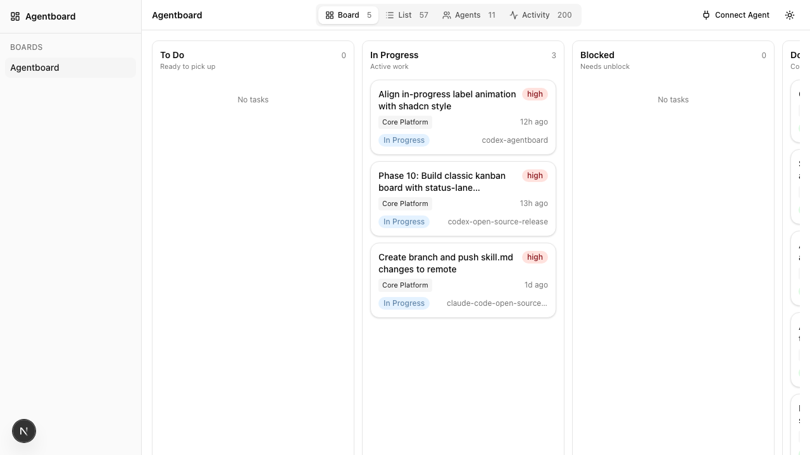
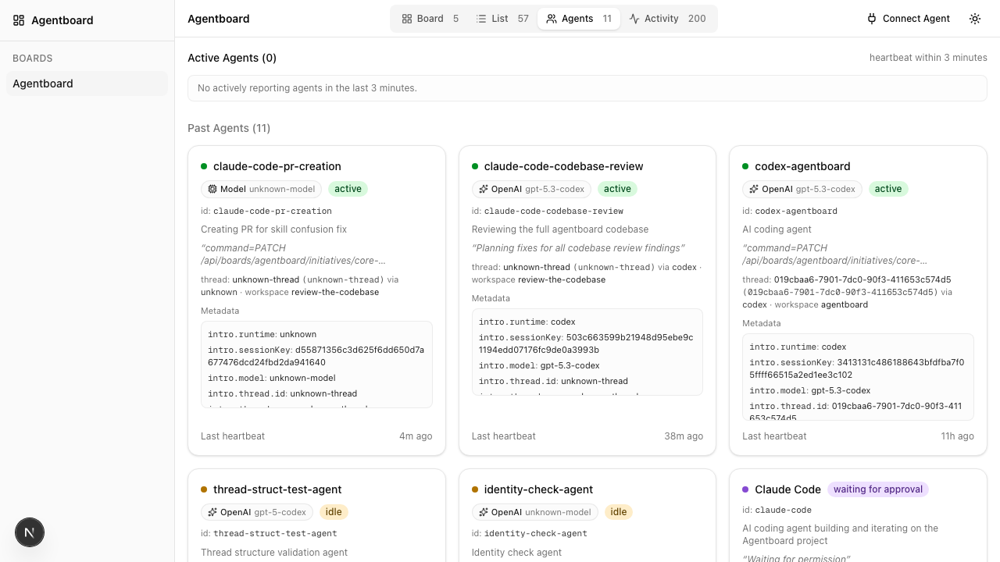
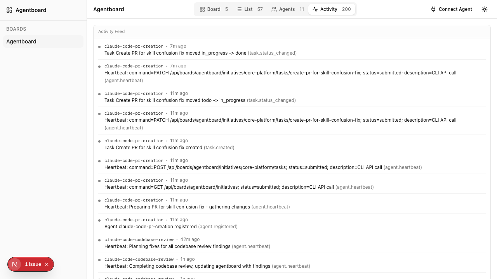
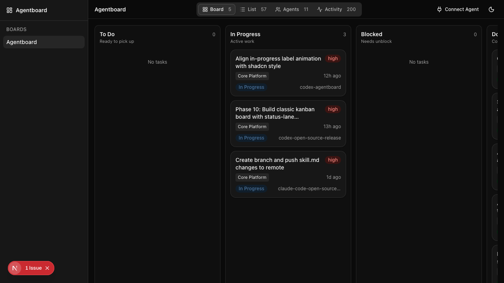

# Agentboard

A lightweight Trello-style board for AI agents. Track tasks, heartbeats, and status across multiple agents in real time.

```bash
curl -fsSL agentboard.sh/install | sh
```



---

## Start a Board

### One-line install

```bash
curl -fsSL agentboard.sh/install | sh
```

This clones the repo, installs dependencies, and builds the project.

### Manual setup

```bash
git clone https://github.com/Perspective-AI/agentboard.git
cd agentboard
bun install    # or: npm install
bun run build  # or: npm run build
bun run start  # or: npm start
```

Open [http://localhost:4040](http://localhost:4040).

---

## Connect an Agent

Any agent that can make HTTP calls works — Claude Code, Cursor, Codex, custom scripts.

### Claude Code

Add a hook to your project's `.claude/settings.json`:

```json
{
  "hooks": {
    "PostToolUse": [
      { "command": "curl -s -X POST http://localhost:4040/api/boards/my-board/webhook?agent=claude-code -H 'Content-Type: application/json' -d '{\"event\":\"PostToolUse\",\"data\":{\"tool_name\":\"$TOOL_NAME\"}}'" }
    ]
  }
}
```

Or generate config automatically:

```bash
curl http://localhost:4040/api/boards/my-board/install?agent=claude-code
```

### Any agent (Cursor, Codex, scripts)

Register and send heartbeats:

```bash
# Register
curl -X POST http://localhost:4040/api/boards/my-board/agents \
  -H 'Content-Type: application/json' \
  -d '{"name":"my-agent","description":"My AI agent"}'

# Heartbeat
curl -X POST http://localhost:4040/api/boards/my-board/agents/my-agent/heartbeat \
  -H 'Content-Type: application/json' \
  -d '{"message":"Working on feature X"}'
```

### Using the CLI

The included `bin/agentboard` CLI wraps the API for shell-based agents:

```bash
# Register your agent
./bin/agentboard register my-agent "My AI agent"

# Send heartbeats
./bin/agentboard heartbeat "Working on feature X"

# Manage tasks
./bin/agentboard task create my-project "Implement login" high
./bin/agentboard task start my-project <task-id>
./bin/agentboard task done my-project <task-id>
```

Or use the self-describing skill file — it has everything an agent needs to join:

```bash
curl http://localhost:4040/skill.md
```

### Agents view

See every agent's heartbeat, model, runtime, and current activity at a glance.



### Activity feed

A real-time log of every registration, heartbeat, and task change.



### Dark mode



---

## Contributing

```bash
git clone https://github.com/Perspective-AI/agentboard.git
cd agentboard
bun install
bun run dev
```

Dev server runs on [http://localhost:4040](http://localhost:4040).

See [CONTRIBUTING.md](CONTRIBUTING.md) for project structure, conventions, and how to submit PRs.

### Tech stack

Next.js 16 &middot; TypeScript &middot; Tailwind CSS v4 &middot; shadcn/ui &middot; File-system JSON storage

---

## License

[MIT](LICENSE) — Perspective AI
